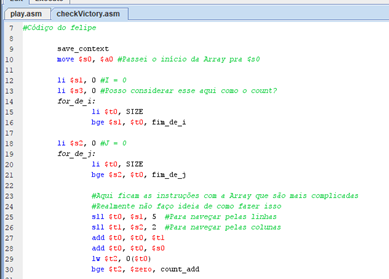
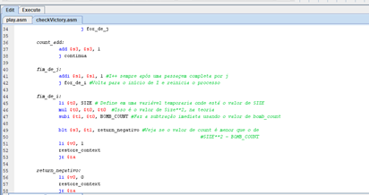
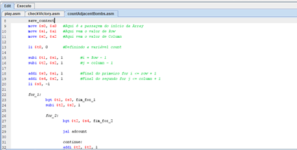
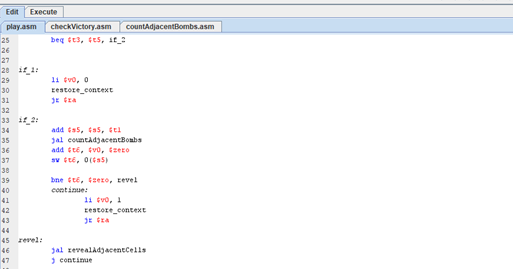
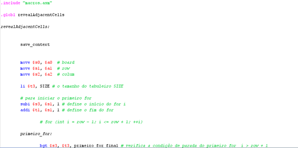
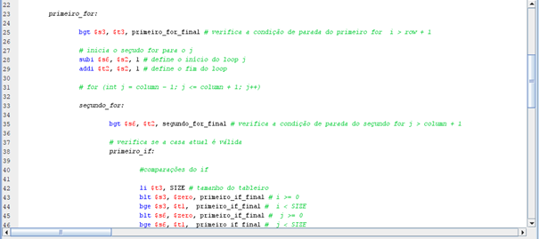
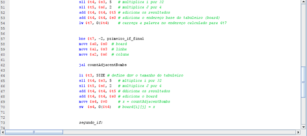
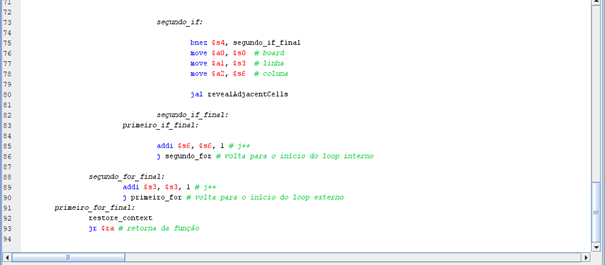

# Campo-Minado-assembly
trabalho de arquitetura

 
																																								
UNIVERSIDADE FEDERAL DO CARIRI
CENTRO DE CIÊNCIAS E TECNOLOGIA
CURSO DE GRADUAÇÃO EM CIÊNCIA DA COMPUTAÇÃO

Av. Tenente Raimundo Rocha Nº 1639
Bairro Cidade Universitária
Juazeiro do Norte - Ceará
CEP 63048-080 

JOSÉ FELIPE BARBOSA DA SILVA – 2022003521
ANTONIO RAFAEL OLIVEIRA DA CUNHA – 2022006292

ATIVIDADE AVALIATIVA 1
MINESWEEPER

 
SUMÁRIO
1.INTRODUÇÃO……….………...………………………………………………………….3
1.1 IMPLEMENTAÇÃO………………….………………………………….………………3 
1.2 CHECKVICTORY …………….……………………………………….………………..4
1.3 COUNTADJACENTBOMBS ……………………………………...……..……………4
1.4 A FUNÇÃO PLAY ………………………………………………………………………5
1.5 A FUNÇÃO REVEAL ADJACENT CELLS…………………………………………..6

1 - INTRODUÇÃO
	Aqui é apresentado o relatório relativo à atividade conforme o apresentado no documento disponibilizado no Google Classroom. A atividade em questão corresponde à implementação do jogo Minesweeper em Assembly fazendo uso do MARS MIPS.
1.1 - IMPLEMENTAÇÃO
	Por mais fora do normal que possa ser, as duas primeiras funções implementadas no código foram CheckVictory e CountAdjacentBombs. O momento mais complexo da construção realmente se deu na busca por quais variáveis poderiam ser utilizadas, e  também onde cada um dos valores necessários vindo de outras funções estava armazenado. Felizmente foi um choque que passou rápido. 

1.2 -  CHECKVICTORY
	Iniciando pelo CheckVictory, usando move para movimentar os endereços e li para inicializar as variáveis nos registradores $sn, foi simples iniciar até a definição das funções, que exigiram um pouco mais de trabalho para navegar entre as colunas linhas e colunas da matriz. Para tal, foi usando o sll (shift left logical) para fazer multiplicações considerando a estrutura organizada em formato linear na memória e com cada “entrada” segmentada em 4. Como cada linha possuía 8 colunas, cada valor de i foi multiplicado por 32 (25) e, para precisão dentro da navegação pelas colunas, os valores de j foram multiplicados por 4 (22). Um fragmento da implementação pode ser visto na figura 1. 

figura 1: Início da função CheckVictory

	A implementação da referida função também possui uma divisão na chamada do for construído. A parte de continua, que foi feita para permitir um salto como uma função IF interna, tendo então um fim na construção do “fim_de_i”, estruturando o size² – BOMB_COUNT para uso de um IF que gera um retorno, enquanto o retorno negativo é referido logo abaixo, ambos possibilitando a volta e restaurando o estado inicial das variáveis que serão necessárias no futuro.

Figura 2 - Função CheckVictory – Fim dos loops e adição da variável count

1.3 – COUNTADJACENTBOMBS
	Já a segunda função implementada, “CountAdjacentBombs” não teve uma implementação muito diferente, embora com menor grau de complexidade. A parte mais difícil estava no IF com quatro ANDs que estava dentro da função. Essa parte específica do código foi estruturada no formato consecutivo de 5 instruções que definiam os inversos pedidos. Dessa maneira, caso alguma delas retornasse um resultado positivo, o programa encaminharia elas para o seguimento da função FOR, caso contrário, seguiria incrementando a variável “count”. Ao fim, o valor da variável COUNT é retornado e as outras variáveis são retornadas ao estado original antes da passagem da função. 
	A maior diferença na comparação de ambas está no fato de a countAdjacentBombs não precisar percorrer todo o vetor verificando os valores, mas sim uma porção pequena. Porção essa que inicia uma linha acima e uma coluna à esquerda da posição de entrada, encontrando o fim na posição matricial uma linha abaixo e uma coluna à direita da mesma entrada.

Figura 3 -  Função CountAdjacentBombs – Início e declaração de 
valores para percorrer a porção certa da matriz.

1.4 – A FUNÇÃO PLAY
	Após as duas primeiras funções prontas, foi o momento da função Play, que ficou pronta relativamente rápido. Isso dado o fato de a funcionalidade ser relativamente simples. Já que ela recebe as coordenadas da jogada e a posição inicial do tabuleiro. Partindo disso, a função no MIPS criada aloca cada uma dessas coisas em um registrador. Posteriormente, define a constante -1 e -2 para as comparações.
	Para começar, as variáveis de linha e coluna serão multiplicadas para determinar a posição exata do conteúdo que o usuário busca com as entradas. A entrada de linha é multiplicada por 8 (quantidade de linhas que estão para trás) e por 4 (Como é dividida uma array no MIPS), já a entrada de coluna, é multiplicada apenas por 4 (posição exata das colunas). Essas duas multiplicações são somadas e adicionadas ao endereço da matriz para se encontrar a posição. Com isso, a função avalia se a posição armazena o valor -1 (que indica uma bomba) ou -2 , que indica uma posição vazia. Com posse dessa informação ele define a derrota em caso de -1, ou então ele faz a contagem do número de bombas adjacentes (já definido na função mais acima).

	Por último, após avaliar a quantidade de bombas adjacentes e defini-la em um registrador, a função toma uma decisão baseada nessa quantidade. Se a quantidade for igual a zero, o jogo revela as casas adjacentes. Caso contrário, ele apenas define a troca do “#” para a quantidade de bombas adjacentes e retorna 1, apontando que o jogo continua. Se a entrada for a posição de uma bomba, ele define a saída como 0 e finaliza o jogo.

Figura 4 – Condições de saída da função Play e seus respectivos retornos.

	Após essa implementação foram feitos testes e encontrados alguns erros, um dos primeiros sendo na countAdjacentBombs. A função estava retornando valores abaixo, muitas vezes ignorando algumas das bombas e outras vezes ignorando todas. Porém isso foi resolvido, o problema estava sendo a forma de percorrer a matriz dentro da função, onde algumas vezes a adição das vaiáveis I e J estavam sendo ignoradas. Não foi muito complexo de alterar.

1.5 A FUNÇÃO REVEAL ADJACENT CELLS

A função revealAdjacetCells, é uma função recursiva que faz com que sejam reveladas as células vizinhas no jogo do campo minado, ela faz isso percorrendo as células ao redor de uma célula dada, definida pelos argumentos de linha e coluna, ou seja a jogada do jogador, para cada célula válida ou seja, dentro dos limites do tabuleiro, ela verifica se a célula está oculta ou seja como foi definido o código em C se ela é igual a -2. Se estiver oculta, a função chama countAdjacentBombs para contar o número de bombas ao redor da casa em que o jogador quis jogar e atualiza o valor da célula com esse número. Se o número de bombas for zero, a função chama a si mesma de maneira recursiva para revelar as células adjacentes à célula atual. Isso continua até que todas as células adjacentes sem bombas ao redor tenham sido reveladas.

Figura 5 - começo da função

E ela consegue realizar isso recebendo os argumentos de entrada o board, linha e coluna e movendo para os para os registradores $s0, $s1 e $s2, respectivamente.
Após isso, a função entra o primeiro loop que percorre as linhas ao redor da célula, o início e o fim do loop são definidos como a linha atual menos 1 e a linha atual mais 1.

 Após esse primeiro loop ela entra no segundo for que percorre as colunas ao redor da célula dada, o início e o fim do loop são definidos parecidos como o do primeiro loop com a coluna atual menos 1  sendo o J e a coluna atual mais 1 sendo o final do loop. Para cada célula no intervalo definido pelo primeiro e segundo for, a função verifica se a célula é válida.

 Uma célula é considerada válida se suas coordenadas de linha e coluna estão dentro dos limites do tabuleiro e se o valor da célula é -2.

 
Figura 6 - percorrendo os loops e fazendo as verificações

Se a célula for válida, a função chama countAdjacentBombs para contar o número de bombas ao redor da célula e atualiza o valor da célula com esse número, e se o número ao redor da casa em que o jogador jogou for zero, ela chama a função de forma recursiva para revelar as células adjacentes, e Após percorrer todas as células adjacentes, a função termina.

 
Figura 7 - chamando a função countadjacetbombs

 
Figura 8 - realizando a recursividade e finalizado o programa

